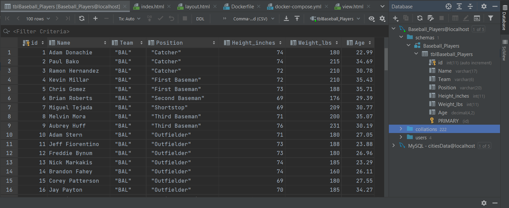
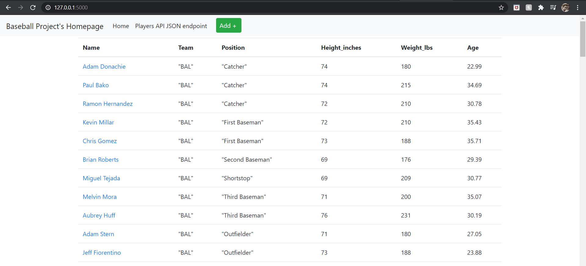
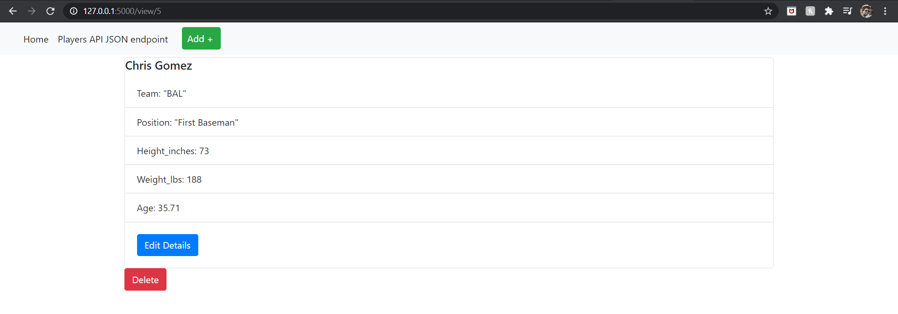
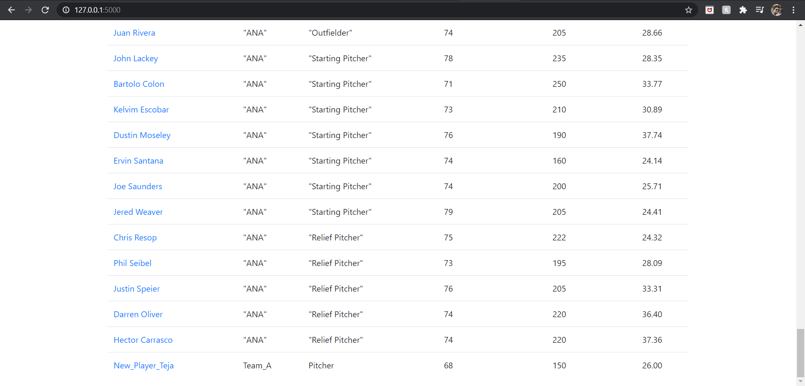
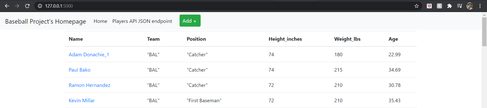
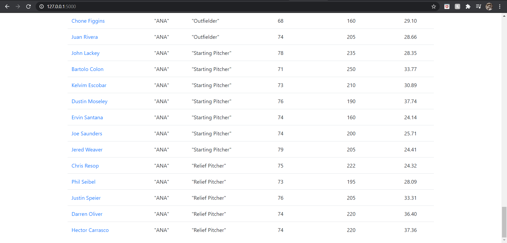

# Project Description (Assignment Part-3)
This project is a homework assignment to create HTML forms to create new records, update records, and a small form that 
has no fields other than a delete button to delete records.

I chose to use Baseball Player Information database for the new application

### Screenshot for DB table in Pycharm

### Screenshot for Homepage with Data

### Screenshot for Single View of a record

### Screenshot for new record added to homepage

### Screenshot for updated record added to homepage

### Screenshot for deleted record (New_Player_Teja) from homepage

### Done by
#### Krishna Teja
