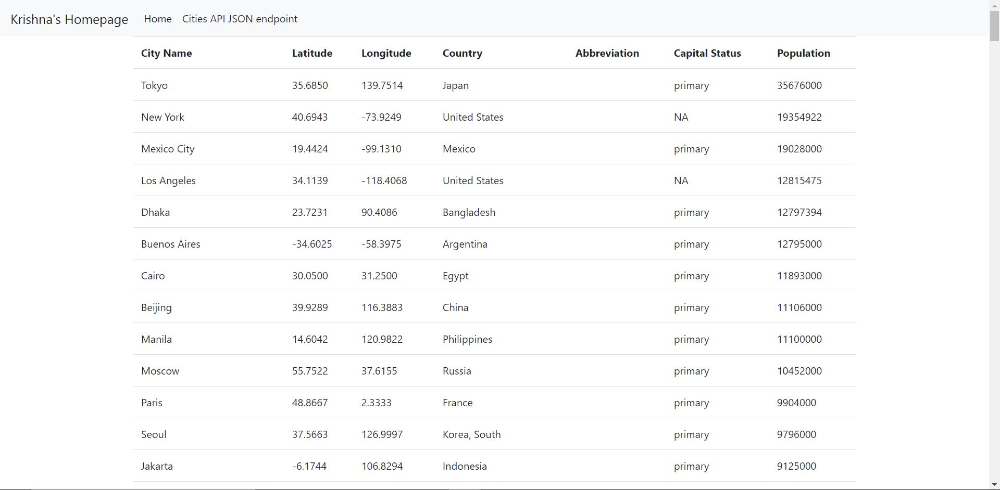
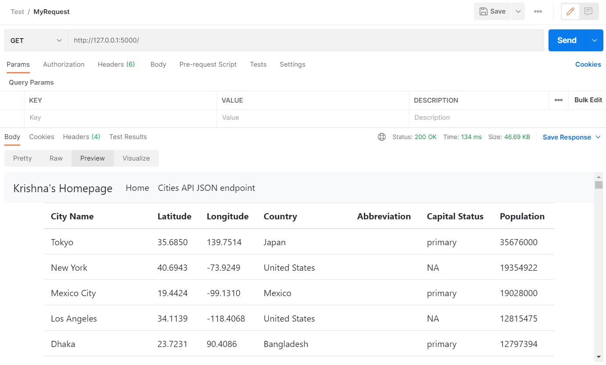

# Project Description (Part-2)
This project is a homework assignment to setup a Bootstrap HTML template using Flask templates and use it to display data retrieved from database.

### Screenshot  for Webpage

### Screenshot for Postman

### Done by
#### Krishna Teja
