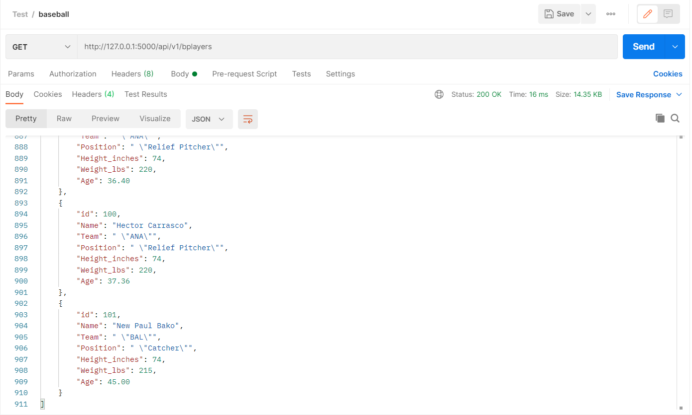

# Project Description (Assignment Part-3)
This project is to create REST API and use POSTMAN to test the GET, POST, PUT, DELETE request methods.

I chose to use Baseball Player Information database for this project.

### GET - All Records

### GET - One Record

### POST - New Record

### New Record added
101 - New Paul Bako record added

### PUT - Edit Record
101 - New Paul Bako age modified to 45

### Record Edited

### Delete - Record delete

### Record Deleted
101 - Record Deleted

### Done by
## Krishna Teja
